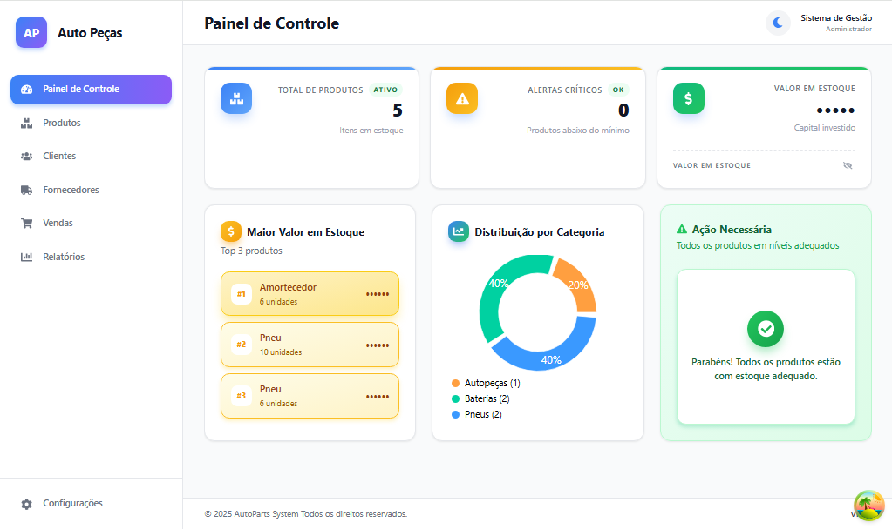
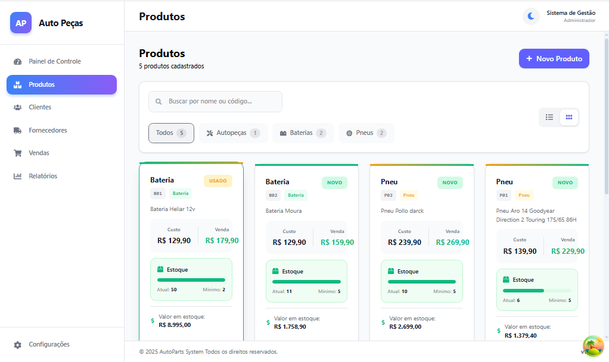

## Prévia da interface

Tela do painel de controle (dashboard):

Tela de listagem de produtos com cards responsivos:

# AutoParts System

Sistema completo de gestão para lojas de autopeças, com foco em controle de estoque, organização de produtos e visão gerencial do negócio.

## Status do projeto

- ✅ Módulo de produtos com layout premium e responsivo
- ✅ Gestão de clientes e fornecedores
- ✅ Dashboard com estatísticas de estoque e categorias
- ✅ Módulo de vendas básico
- 🚧 Relatórios gerenciais (em desenvolvimento)
- 🚧 Autenticação e controle de acessos
- 🚧 PDV (Ponto de Venda) otimizado para balcão

---

## Funcionalidades principais

- **Gestão de Produtos**

  - Cadastro completo com custo, preço de venda, estoque mínimo e atual
  - Suporte a categorias específicas: pneus, baterias e autopeças
  - Especificações técnicas por tipo de produto
  - Compatibilidade com veículos (modelo/marca/ano)

- **Gestão de Clientes e Fornecedores**

  - CRUD completo
  - Dados de contato e identificação

- **Vendas**

  - Registro de vendas com itens, quantidade e forma de pagamento
  - Atualização de estoque automática

- **Dashboard**
  - Resumo de produtos, estoque baixo e valor em estoque
  - Distribuição por categoria
  - Lista de itens mais caros e itens com estoque crítico

---

## Tecnologias utilizadas

### Backend

- Node.js + TypeScript
- Express.js
- Prisma ORM
- PostgreSQL
- Dotenv para variáveis de ambiente

### Frontend

- React + TypeScript
- Vite
- React Router
- Axios
- Estilização com CSS e inline styles

---

## Como executar o projeto

### Pré-requisitos

- Node.js 18+
- PostgreSQL 14+
- npm ou yarn

### 1. Clonar o repositório

git clone https://github.com/RFernandes10/autoparts-system.git
cd autoparts-system

### 2. Backend

cd backend
npm install
cp .env.example .env # se existir arquivo de exemplo

configure as variáveis de banco no .env
npx prisma migrate dev
npm run dev

O backend ficará em: `http://localhost:3000`.

### 3. Frontend

Em outro terminal:

cd frontend
npm install
npm run dev

O frontend ficará em: `http://localhost:5173`.

---

## Estrutura do projeto

autoparts-system/
├── backend/ # API REST
│ ├── src/
│ │ ├── controllers/
│ │ ├── services/
│ │ ├── routes/
│ │ └── config/
│ └── prisma/
│ └── schema.prisma
└── frontend/ # Interface web
├── src/
│ ├── assets/
│ ├── components/
│ ├── contexts/
│ ├── hooks/
│ ├── pages/
│ ├── services/
│ └── types/
└── public/

---

## Modelo de dados (principal)

- `produtos` – catálogo de produtos
- `clientes` – cadastro de clientes
- `fornecedores` – cadastro de fornecedores
- `vendas` – registro de vendas
- `itens_venda` – itens de cada venda
- `movimentacoes_estoque` – histórico de entrada e saída de estoque

---

## Desenvolvedor

**Roberto Fernandes**

- GitHub: [@RFernandes10](https://github.com/RFernandes10)

---

## Licença

Este projeto está sob a licença MIT. Sinta‑se à vontade para estudar, melhorar e adaptar para o seu uso.

> Projeto focado em aprendizado com boas práticas de front-end, back-end e versionamento (commits semânticos).
